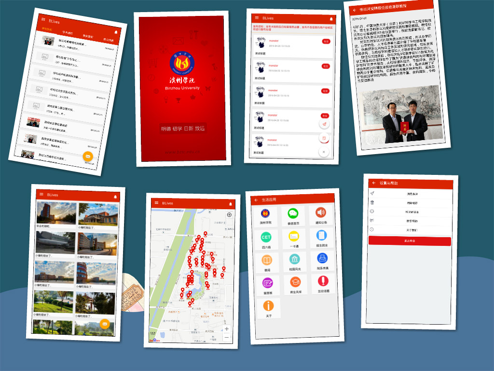

# BLives
> 历时两个多月，Blives程序1.0诞生
> 
> 虽然程序存在bug，存在不足，但是我也在认真的在修复，在更新，在完善
> 
> 由于小编实力有限，如果不足，肯定各位大神们指出，小编必当感激不敬

## 引言
- 设计本程序的目的是为了方便母校的日常生活，初衷就是想让母校有一款属于自己的app，大学为我们做出了很多，同时我们也应该为大学做点自己应有的贡献，程序1.0 bug很多，但是我相信，在以后的日子里，blives会变得更加的优秀，更加的完美，因为有付出，定有回报

- 在程序设计期间，自己经历了很多事情，恋爱的挫折，考试的折磨，成绩的痛苦，但是自己还是坚持的完成了自己的程序，虽然在考试的结果领自己十分不满意，但是我做了，我努力了，我不后悔，该来的还是要来，该经历的还是要经历

- 程序版本1.0，在随后的日子里，小编会继续对程序予以完善，版本更新

## 程序主页
- [http://binzhouuniversity.github.io](http://binzhouuniversity.github.io/)

## 版本
 - `1.0`

## 技术
 - 程序采用了material design设计风格，在设计上注重用户交互性(不断完善)
 - 数据库采用Bmob后端云技术
 - 功能：学校咨询查看，学校美景浏览，校园活动，校园广场，生活应用等板块

## 联系小编
 - Email : linfanrong235@outlook.com

## 鸣谢
 - 技术支持
  - @蓝默
  - @全世界Coder
 - UI支持
  - @磁力链接君(weibo)
  - @柠木

## 下载试用
  - [点我下载](http://binzhouuniversity.github.io/app/app-release.encrypted_signed_Aligned.apk)

## 截图欣赏
  

